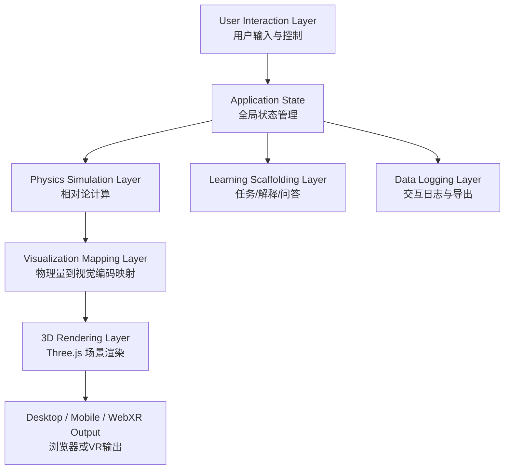
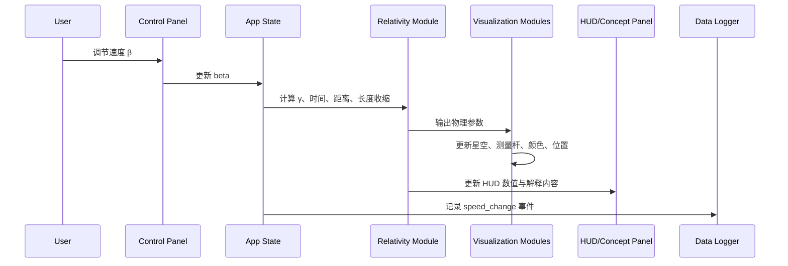
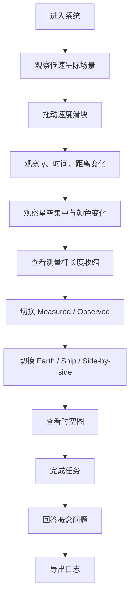

# Relativistic Voyager Alpha MVP 说明文档

**中文标题：相对论航行者：面向狭义相对论理解的近光速星际旅行沉浸式 3D 可视化交互系统**  
**英文标题：Relativistic Voyager: An Immersive 3D Interactive Visualization System for Understanding Special Relativity through Near-Light-Speed Interstellar Travel**

---

## 1. 文档目的

本文档用于说明 **Relativistic Voyager Alpha MVP** 的项目定位、功能范围、系统架构、核心模块、交互流程、开发路线、运行方式和后续扩展方向。它既可以作为开发说明文档，也可以作为 proposal、课堂展示、研究汇报和初步 user study 的技术支撑材料。

本项目采用 **Three.js + WebXR** 构建浏览器端 3D 交互系统，目标是让用户通过“近光速星际旅行”的体验理解狭义相对论中的核心概念，包括时间膨胀、长度收缩、参考系差异、相对论性多普勒效应、恒星光行差和光速极限。

---

## 2. 项目定位

### 2.1 项目类型

本项目不是完整的天体物理模拟器，也不是单纯的 3D 星空演示，而是一个面向科学教育与人机交互研究的 **沉浸式相对论学习原型系统**。

它的重点不在于做出最复杂的视觉特效，而在于通过交互设计帮助用户理解：

- 为什么接近光速时，不同参考系下的时间和距离会不同；
- 为什么时间膨胀和长度收缩不是普通视觉错觉；
- 为什么观察者“看到的图像”和参考系中“测量到的物理量”并不完全相同；
- 为什么光速是不可超越的速度极限；
- 如何把公式、3D 体验和时空图联系起来理解。

### 2.2 当前版本定位

当前版本定义为 **Alpha MVP / Research Prototype**。它比最小可运行 demo 更完整，但仍然保留可快速迭代的轻量结构。

当前版本应至少支持：

1. 浏览器端 3D 场景运行；
2. 速度 β = v/c 的交互控制；
3. 洛伦兹因子 γ 的实时计算；
4. 地球参考系时间与飞船固有时间对比；
5. 地球参考系距离与飞船参考系距离对比；
6. 测量杆长度收缩；
7. 星空光行差近似表现；
8. 多普勒颜色变化近似表现；
9. Measured / Observed 双模式；
10. Earth / Ship / Side-by-side 参考系切换；
11. 学习任务系统；
12. 概念解释面板；
13. 概念问答系统；
14. Minkowski 时空图；
15. 用户交互日志导出；
16. WebXR / VR 入口。

---

## 3. 为什么当前 MVP 聚焦狭义相对论

本项目当前只实现 **狭义相对论**，暂不实现广义相对论。

### 3.1 狭义相对论适合本项目的原因

狭义相对论主要研究在无引力或忽略引力的情况下，接近光速运动带来的时间、空间和观察差异。它非常适合“近光速星际旅行”的交互场景。

当前 MVP 涉及的概念包括：

- 光速不变；
- 惯性参考系；
- 时间膨胀；
- 长度收缩；
- 同时性的相对性；
- 相对论性多普勒效应；
- 恒星光行差；
- 固有时间与坐标时间；
- 观察结果与测量结果的区别。

### 3.2 广义相对论暂不纳入 MVP 的原因

广义相对论主要研究引力、时空弯曲和强引力场中的物理现象，例如：

- 黑洞；
- 引力透镜；
- 引力时间膨胀；
- 测地线；
- 时空曲率；
- 强引力场中的光线弯曲。

这些内容会显著增加物理模型、渲染模型和用户理解难度。如果 MVP 同时实现狭义和广义相对论，项目范围会变得过大，研究问题也会不够聚焦。

因此，当前版本建议明确聚焦：

> 通过近光速星际旅行帮助用户理解狭义相对论。

广义相对论可以作为后续 Future Work，例如扩展为“黑洞附近的时空旅行”“引力透镜可视化”或“强引力场中的时间膨胀体验”。

---

## 4. 目标用户

当前系统主要面向以下用户：

1. 高中或大学低年级物理学习者；
2. 对相对论、宇宙和星际旅行感兴趣的普通公众；
3. 科学博物馆、天文馆和课堂教学场景中的参观者或学生；
4. HCI、可视化、VR/AR、科学教育方向的研究人员；
5. 希望通过交互式可视化理解抽象科学概念的用户。

用户不需要提前掌握复杂数学推导，但需要能理解基本的速度、时间、距离和观察者视角概念。

---

## 5. 核心学习目标

系统希望用户完成体验后，能够理解以下问题：

1. 当飞船速度接近光速时，为什么地球参考系和飞船参考系中的时间不同？
2. 为什么飞船乘员经历的固有时间可能少于地球上经过的时间？
3. 为什么高速飞船参考系中，前方星际距离会发生收缩？
4. 为什么星空会向运动方向集中？
5. 为什么前方星光会出现蓝移，后方星光会出现红移？
6. 为什么长度收缩不是简单的“看起来变短”？
7. 为什么观察者看到的视觉图像和参考系中的物理测量结果需要区分？
8. 为什么飞船无法超过光速？
9. 如何用时空图理解地球世界线、飞船世界线和光信号传播？

---

## 6. MVP 功能范围

### 6.1 必须实现的核心功能

| 功能模块 | 当前 MVP 要求 | 说明 |
|---|---|---|
| 3D 场景 | 必须 | 星空、飞船、地球、目标恒星、测量杆 |
| 速度控制 | 必须 | β = v/c，范围 0–0.99 |
| 洛伦兹因子计算 | 必须 | 实时显示 γ |
| 时间膨胀 | 必须 | 显示 Earth time 与 Ship proper time |
| 长度收缩 | 必须 | 测量杆沿运动方向缩短 |
| 距离收缩 | 必须 | 显示地球系距离和飞船系距离 |
| 星空光行差 | 必须，近似即可 | 星星向前进方向集中 |
| 多普勒颜色变化 | 必须，近似即可 | 前方蓝移，后方红移 |
| 参考系切换 | 必须 | Earth / Ship / Side-by-side |
| Measured / Observed 模式 | 必须 | 区分测量结果和视觉观察 |
| 概念解释 | 必须 | 分层解释：现象、直观解释、公式、参考系 |
| 学习任务 | 必须 | 引导用户逐步探索 |
| 概念问答 | 必须 | 检查用户理解 |
| 时空图 | 必须 | 简化 Minkowski diagram |
| 日志导出 | 必须 | JSON / CSV |
| WebXR 入口 | 建议实现 | 支持 VR 设备访问 |

### 6.2 当前暂不实现的功能

当前 MVP 暂不实现：

- 完整广义相对论；
- 黑洞与引力透镜；
- 高精度光线追踪；
- 真实星表数据导入；
- 多人协同学习；
- 后端数据库；
- 用户账号系统；
- 完整实验管理平台；
- 完整 VR 手柄驾驶舱交互。

这些内容可作为后续版本扩展。

---

## 7. 技术栈

### 7.1 前端与 3D 渲染

- **Three.js**：负责 3D 场景、相机、材质、粒子星空和对象渲染；
- **WebXR**：支持浏览器端 VR 访问；
- **Vite**：用于前端开发、模块打包和本地运行；
- **JavaScript ES Modules**：模块化组织代码；
- **Canvas 2D**：绘制 Minkowski 时空图；
- **HTML / CSS**：构建 HUD、控制面板、任务面板和问答界面。

### 7.2 可选扩展技术

后续可以加入：

- **TypeScript**：增强类型安全；
- **GLSL Shader**：实现更准确的多普勒颜色、亮度变化和光行差；
- **React / Vue**：用于更复杂的 UI 状态管理；
- **Node.js / Express / FastAPI**：用于实验数据后端；
- **SQLite / PostgreSQL / Firebase**：用于用户实验数据存储。

---

## 8. 系统架构

### 8.1 总体架构

系统采用前端模块化结构，主要分为六层：



### 8.2 数据流

用户调节速度后，系统执行以下流程：



---

## 9. 推荐目录结构

```text
relativistic-voyager-alpha/
├── package.json
├── index.html
├── README.md
├── MVP_COMPLETE_GUIDE.md
├── ALPHA_DESIGN_SPEC.md
└── src/
    ├── main.js
    ├── style.css
    │
    ├── core/
    │   └── App.js
    │
    ├── physics/
    │   └── relativity.js
    │
    ├── visual/
    │   ├── StarField.js
    │   ├── Spacecraft.js
    │   ├── MeasurementRod.js
    │   ├── SceneObjects.js
    │   └── SpacetimeDiagram.js
    │
    ├── ui/
    │   ├── ControlPanel.js
    │   ├── Hud.js
    │   ├── ConceptPanel.js
    │   ├── MissionSystem.js
    │   ├── QuizSystem.js
    │   └── DataLogger.js
    │
    └── data/
        ├── missions.js
        ├── quizzes.js
        └── concepts.js
```

---

## 10. 核心模块说明

### 10.1 App.js

`App.js` 是系统主控制器，负责初始化 Three.js 场景、相机、渲染器、WebXR、UI 模块、数据记录器和动画循环。

主要职责：

- 初始化场景；
- 维护全局状态；
- 调用物理计算模块；
- 更新所有可视化对象；
- 更新 HUD 与学习面板；
- 响应用户交互；
- 记录用户行为；
- 控制主渲染循环。

建议维护的全局状态包括：

```js
const state = {
  beta: 0,
  gamma: 1,
  earthTime: 0,
  shipTime: 0,
  earthDistance: 4.24,
  shipDistance: 4.24,
  frameMode: 'side-by-side',
  viewMode: 'measured',
  paused: false,
  currentMissionId: 'mission-01',
  currentConceptLevel: 1
};
```

---

### 10.2 relativity.js

该模块负责所有狭义相对论相关计算。

建议包含：

```js
export function clampBeta(beta) {
  return Math.min(0.999, Math.max(0, beta));
}

export function lorentzFactor(beta) {
  const b = clampBeta(beta);
  return 1 / Math.sqrt(1 - b * b);
}

export function timeDilation(earthFrameTime, beta) {
  return earthFrameTime / lorentzFactor(beta);
}

export function lengthContraction(restLength, beta) {
  return restLength / lorentzFactor(beta);
}

export function contractedDistance(restDistance, beta) {
  return restDistance / lorentzFactor(beta);
}

export function dopplerFactor(beta, cosTheta) {
  const gamma = lorentzFactor(beta);
  return gamma * (1 + beta * cosTheta);
}

export function aberratedCosTheta(beta, cosTheta) {
  const b = clampBeta(beta);
  return (cosTheta + b) / (1 + b * cosTheta);
}
```

注意：MVP 中的 Doppler 和 aberration 可以先使用近似表达。正式研究版需要进一步验证公式、符号方向和视觉映射是否符合物理解释。

---

### 10.3 StarField.js

`StarField.js` 负责创建和更新星空。

功能要求：

- 创建大量星点；
- 星点分布在用户周围；
- 根据 β 调整星星向前方集中的程度；
- 根据相对方向调整颜色偏移；
- 支持低速到高速的连续变化。

视觉目标：

```text
β = 0.0：星空均匀分布
β = 0.5：前方星点略微集中
β = 0.9：前方星点明显集中，颜色变化明显
β = 0.99：前方形成强烈视觉集中区
```

---

### 10.4 MeasurementRod.js

`MeasurementRod.js` 负责显示长度收缩。

功能要求：

- 在场景中显示一根测量杆；
- 显示原长与收缩后长度；
- 在 Measured Mode 中按 `L = L0 / γ` 缩短；
- 在 Observed Mode 中显示不同样式，提示用户“观察外观不等同于测量长度”；
- 可在 HUD 中显示原长、当前长度和收缩比例。

该模块是研究贡献中的关键部分，因为它直接支撑：

> Measured vs Observed dual-mode visualization.

---

### 10.5 SpacetimeDiagram.js

`SpacetimeDiagram.js` 使用 Canvas 2D 绘制简化 Minkowski 时空图。

建议包含：

- 纵轴：ct 或时间；
- 横轴：x 或空间位置；
- 地球世界线：垂直线；
- 飞船世界线：倾斜线；
- 光锥：45 度线；
- 当前速度对应的世界线斜率；
- 当前事件点。

MVP 中不需要复杂交互，但应让用户理解：

- 静止观察者的世界线；
- 高速飞船的世界线；
- 光信号传播的边界；
- 为什么不同速度对应不同的时空路径。

---

### 10.6 ControlPanel.js

控制面板负责用户输入。

功能要求：

- β 速度滑块；
- 速度预设按钮：0.1c、0.5c、0.8c、0.9c、0.99c；
- 参考系切换：Earth / Ship / Side-by-side；
- 显示模式切换：Measured / Observed；
- 暂停按钮；
- 重置按钮；
- 导出日志按钮。

---

### 10.7 Hud.js

HUD 负责实时显示关键数值。

建议显示：

- 当前速度 β；
- 洛伦兹因子 γ；
- 地球参考系时间；
- 飞船固有时间；
- 地球参考系距离；
- 飞船参考系距离；
- 测量杆原长；
- 测量杆当前长度；
- 当前参考系模式；
- 当前显示模式。

---

### 10.8 ConceptPanel.js

概念解释面板提供分层学习脚手架。

建议分为四层：

| 层级 | 内容 | 目的 |
|---|---|---|
| Level 1 | 现象描述 | 让用户先观察发生了什么 |
| Level 2 | 直观解释 | 用通俗语言解释为什么 |
| Level 3 | 公式解释 | 连接 β、γ、时间膨胀、长度收缩 |
| Level 4 | 参考系解释 | 解释不同参考系如何描述同一事件 |

这种设计可以降低认知负荷，避免用户一开始就被公式压倒。

---

### 10.9 MissionSystem.js

任务系统负责引导用户探索。

建议包含以下任务：

| 任务 ID | 名称 | 学习目标 |
|---|---|---|
| mission-01 | 低速基线观察 | 建立日常直觉基线 |
| mission-02 | 加速到 0.5c | 观察 γ 开始变化 |
| mission-03 | 加速到 0.9c | 观察明显时间膨胀 |
| mission-04 | 比较地球时间与飞船时间 | 理解固有时间 |
| mission-05 | 观察长度收缩 | 理解测量模式 |
| mission-06 | 切换 Observed Mode | 区分观察结果与测量结果 |
| mission-07 | 切换参考系 | 理解 reference frame |
| mission-08 | 查看时空图 | 建立时空表示 |
| mission-09 | 完成概念问答 | 检查理解 |

---

### 10.10 QuizSystem.js

概念问答系统用于形成可评估的学习结果。

建议问题类型：

1. 单选题；
2. 判断题；
3. 简短解释题；
4. 情境迁移题。

示例问题：

```text
Q1：当飞船速度接近光速时，从地球参考系看，飞船上的钟会怎样？
A. 变快
B. 变慢
C. 不变
D. 停止存在
正确答案：B
```

```text
Q2：长度收缩是否只是视觉错觉？
A. 是，只是看起来变短
B. 不是，它是某一参考系中的测量结果
C. 是，因为物体真实长度不会变
D. 无法判断
正确答案：B
```

---

### 10.11 DataLogger.js

日志系统用于记录用户行为，为 user study 提供数据。

建议记录事件：

| 事件名 | 说明 |
|---|---|
| start | 用户进入系统 |
| speed_change | 用户拖动速度滑块 |
| speed_preset | 用户点击速度预设 |
| frame_change | 用户切换参考系 |
| view_mode_change | 用户切换 Measured / Observed |
| mission_start | 开始任务 |
| mission_complete | 完成任务 |
| quiz_answer | 提交问答答案 |
| concept_level_change | 切换解释层级 |
| pause_toggle | 暂停或继续 |
| reset | 重置系统 |
| export_log | 导出日志 |

建议日志格式：

```json
{
  "timestamp": "2026-07-06T09:00:00.000Z",
  "event": "speed_change",
  "beta": 0.9,
  "gamma": 2.294,
  "frameMode": "side-by-side",
  "viewMode": "measured",
  "missionId": "mission-03"
}
```

导出格式：

- JSON：保留完整结构；
- CSV：便于 SPSS、R、Python、Excel 分析。

---

## 11. 用户交互流程

### 11.1 基本流程



### 11.2 教学路径

系统的教学路径可以概括为：

> Experience → Comparison → Explanation → Reflection

具体含义：

1. **Experience**：用户通过飞船速度调节体验相对论现象；
2. **Comparison**：用户比较不同参考系下的时间、距离和观察结果；
3. **Explanation**：系统提供分层解释和公式说明；
4. **Reflection**：用户通过任务和问答检验理解。

---

## 12. 关键设计原则

### 12.1 不做纯视觉奇观

系统不能只是展示星空扭曲或科幻特效。每一个视觉变化都应对应一个明确的物理概念或学习目标。

### 12.2 明确区分测量和观察

Measured Mode 和 Observed Mode 是本项目的重要研究创新点。用户需要理解：

- 测量结果来自参考系中的物理定义；
- 视觉观察结果来自光信号到达观察者后的图像；
- 两者相关，但不能简单等同。

### 12.3 参考系切换必须可见、可比较

相对论学习的核心是参考系。系统不应只提供一个视角，而应让用户能够明确比较：

- 地球参考系；
- 飞船参考系；
- 并列比较模式；
- 观察者视觉模式。

### 12.4 先体验，再解释

初学者不应一开始面对复杂公式。系统应先让用户观察现象，再逐步引入解释和公式。

### 12.5 每个交互都应可记录

如果系统要用于 user study，就必须记录关键交互行为，例如速度调节、参考系切换、任务完成和问答结果。

---

## 13. 运行方式

### 13.1 安装依赖

```bash
npm install
```

### 13.2 本地运行

```bash
npm run dev
```

然后打开终端中显示的本地地址，例如：

```text
http://localhost:5173
```

### 13.3 局域网访问

如果希望手机、平板或 VR 设备访问本机运行的系统，可以使用：

```bash
npm run dev -- --host 0.0.0.0
```

然后使用同一局域网设备访问本机 IP 地址。

### 13.4 WebXR / VR 注意事项

WebXR 通常要求安全上下文，因此正式 VR 测试建议使用：

- localhost；
- HTTPS；
- 支持 WebXR 的浏览器；
- 支持 WebXR 的 VR 设备。

---

## 14. 开发阶段规划

### Phase 1：基础可运行版本

目标：让系统可以跑起来。

功能包括：

- Three.js 场景；
- 星空；
- 飞船；
- 速度滑块；
- β 和 γ 显示；
- 基础时间膨胀显示。

验收标准：

- 浏览器可以打开；
- 用户可以调节速度；
- γ 值能实时变化；
- 地球时间和飞船时间能显示差异。

---

### Phase 2：相对论可视化版本

目标：把物理变量映射到视觉变化。

功能包括：

- 测量杆长度收缩；
- 地球距离与飞船距离对比；
- 星空集中效果；
- 多普勒颜色近似；
- Measured / Observed 模式。

验收标准：

- 速度越高，长度收缩越明显；
- 速度越高，飞船参考系距离越短；
- 星空向前进方向集中；
- 用户可以清楚看到两种模式的区别。

---

### Phase 3：学习脚手架版本

目标：让系统从 demo 变成教学研究原型。

功能包括：

- 概念解释面板；
- 分层解释；
- 任务系统；
- 概念问答；
- 时空图。

验收标准：

- 用户可以按任务顺序学习；
- 每个任务对应明确概念；
- 问答系统能记录答案；
- 时空图能随速度变化更新。

---

### Phase 4：实验记录版本

目标：支持初步 user study。

功能包括：

- 交互日志；
- JSON / CSV 导出；
- 用户 ID；
- 实验条件标记；
- Pre-test / Post-test 页面；
- NASA-TLX / SUS / Presence 问卷。

验收标准：

- 每个关键交互都能被记录；
- 数据可以导出分析；
- 可以支持至少 20–60 人的初步用户实验。

---

### Phase 5：高级沉浸式版本

目标：增强 VR 和物理视觉表现。

功能包括：

- VR 手柄交互；
- 驾驶舱仪表盘；
- 空间浮动解释卡片；
- 更准确的 relativistic shader；
- 光传播时间延迟；
- Penrose-Terrell rotation 近似表现。

---

## 15. 用户研究设计支持

当前 MVP 可以支持以下实验设计。

### 15.1 实验条件

可以设置三组：

1. **传统 2D 学习组**：文本、公式、二维图示；
2. **桌面 3D 交互组**：使用 Three.js 桌面版本；
3. **WebXR 沉浸式组**：使用 VR / WebXR 版本。

### 15.2 自变量

- 学习方式；
- 是否有 Measured / Observed 双模式；
- 是否可以切换参考系；
- 是否有时空图辅助；
- 是否使用 VR 沉浸模式。

### 15.3 因变量

- 前测 / 后测概念得分；
- 问答正确率；
- 误解纠正率；
- 任务完成时间；
- 参考系切换次数；
- Measured / Observed 模式使用次数；
- SUS 可用性评分；
- NASA-TLX 认知负荷；
- Presence / Engagement 评分；
- 访谈中的理解变化。

### 15.4 可测试研究问题

当前 MVP 可以支撑以下研究问题：

1. 参考系切换是否帮助用户理解时间膨胀和长度收缩？
2. Measured / Observed 双模式是否减少用户对长度收缩的误解？
3. 沉浸式 3D 体验是否比 2D 材料更能提高相对论概念理解？
4. 时空图是否帮助用户将视觉体验与形式化物理表达联系起来？
5. 用户在高沉浸体验中是否会产生更高认知负荷？

---

## 16. 验收标准

### 16.1 功能验收

系统应满足：

- 页面可正常加载；
- 3D 场景可正常渲染；
- 速度控制可用；
- γ、时间、距离和长度变化正确更新；
- 参考系切换可用；
- Measured / Observed 模式切换可用；
- 星空变化和颜色变化可见；
- 任务系统可用；
- 问答系统可用；
- 时空图可显示；
- 日志可导出。

### 16.2 教学验收

用户应能通过系统理解：

- γ 值随速度变化的趋势；
- 飞船时间与地球时间不同；
- 高速参考系中的距离收缩；
- 长度收缩是参考系测量结果；
- 观察结果和测量结果需要区分；
- 光速不可超越。

### 16.3 研究验收

系统应能支持：

- 记录用户关键交互；
- 导出可分析数据；
- 设置不同实验条件；
- 支持前后测；
- 支持至少一次 pilot study。

---

## 17. 当前局限

当前 MVP 仍有以下局限：

1. 多普勒效应和恒星光行差仍是近似可视化；
2. Observed Mode 还没有完整实现光传播时间延迟；
3. 没有真实星表数据；
4. 没有后端数据库；
5. 没有完整 VR 手柄驾驶体验；
6. 没有实现广义相对论；
7. 时空图仍是教学简化版，不是完整物理推导工具；
8. 视觉效果需要进一步与物理公式严格校验。

这些局限可以在论文或 proposal 中说明，避免过度声称系统的物理精确性。

---

## 18. 后续扩展方向

### 18.1 物理准确性增强

- 更准确的 relativistic Doppler shader；
- 更准确的 stellar aberration；
- 光传播时间延迟；
- Penrose-Terrell rotation；
- 更严格的 measured / observed 区分；
- 使用真实星表数据。

### 18.2 教学功能增强

- Pre-test / Post-test；
- 自动评分；
- 错误类型诊断；
- 个性化学习路径；
- 课堂教师控制模式；
- 学生学习报告自动生成。

### 18.3 VR 交互增强

- VR 手柄射线选择；
- 驾驶舱油门；
- 空间中的浮动解释卡片；
- VR 中的任务面板；
- 观察对象抓取、放大和比较；
- 沉浸式时空图。

### 18.4 实验平台增强

- 用户账号或匿名 ID；
- 实验条件自动分配；
- 数据上传 API；
- 后端数据库；
- 实验管理后台；
- 数据可视化 dashboard。

### 18.5 广义相对论扩展

作为 Future Work，可以开发独立扩展模块：

- 黑洞附近时间膨胀；
- 引力透镜；
- 时空弯曲可视化；
- 引力波概念可视化；
- 强引力场中的光线路径。

但这些不建议纳入当前 MVP。

---

## 19. 推荐开发任务列表

### Sprint 1：核心场景与状态

- [ ] 初始化 Vite + Three.js 项目；
- [ ] 创建 Scene / Camera / Renderer；
- [ ] 加入星空、飞船、地球、目标恒星；
- [ ] 创建全局 state；
- [ ] 实现动画循环。

### Sprint 2：相对论计算

- [ ] 实现 β 控制；
- [ ] 实现 γ 计算；
- [ ] 实现时间膨胀；
- [ ] 实现长度收缩；
- [ ] 实现距离收缩；
- [ ] 在 HUD 中显示数值。

### Sprint 3：视觉映射

- [ ] 实现测量杆长度变化；
- [ ] 实现星空集中；
- [ ] 实现多普勒颜色近似；
- [ ] 实现 Measured / Observed 模式；
- [ ] 实现参考系切换。

### Sprint 4：教学脚手架

- [ ] 实现概念解释面板；
- [ ] 实现解释层级；
- [ ] 实现任务系统；
- [ ] 实现问答系统；
- [ ] 实现时空图。

### Sprint 5：实验数据

- [ ] 实现 DataLogger；
- [ ] 记录交互事件；
- [ ] 实现 JSON 导出；
- [ ] 实现 CSV 导出；
- [ ] 增加实验条件字段。

### Sprint 6：WebXR 与优化

- [ ] 加入 VRButton；
- [ ] 启用 renderer.xr；
- [ ] 优化移动端显示；
- [ ] 优化 VR 中 HUD 可读性；
- [ ] 测试 Quest / WebXR 浏览器兼容性。

---

## 20. 项目核心贡献表述

在 proposal 或论文中，可以将本 MVP 的贡献表述为：

1. 提出一个基于近光速星际旅行的狭义相对论沉浸式 3D 学习环境；
2. 通过 Reference-frame switching 帮助用户比较不同惯性参考系中的时间、距离和事件描述；
3. 通过 Measured / Observed 双模式帮助用户区分物理测量结果和视觉观察结果；
4. 将体验、比较、解释和反思整合为完整学习路径；
5. 提供可记录用户行为的 WebXR 原型，为后续用户实验提供技术基础。

---

## 21. 一句话总结

**Relativistic Voyager Alpha MVP 是一个基于 Three.js + WebXR 的狭义相对论沉浸式学习原型，它通过近光速星际旅行、参考系切换、Measured/Observed 双模式、时空图和任务问答，把抽象的相对论概念转化为可体验、可比较、可解释、可评估的交互学习过程。**
